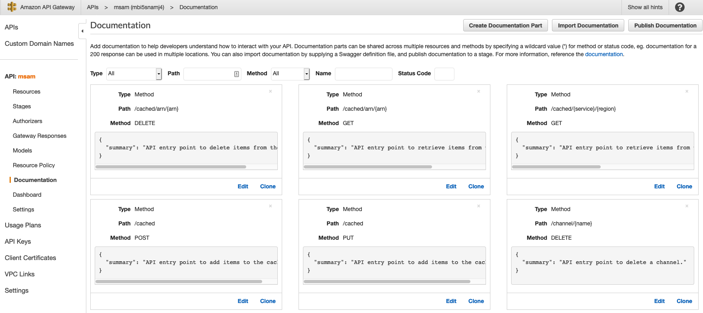
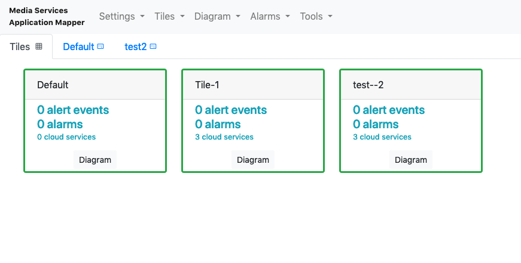
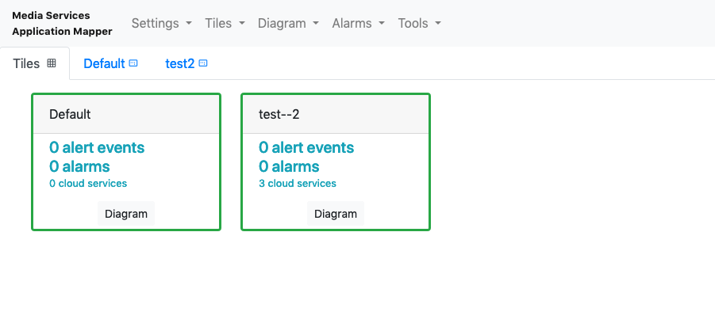

# REST API

## Amazon API Gateway
Some information regarding the API can be found in the API Gateway. Using the Services menu in the AWS Console navigate to the 'API Gateway', from there choose 'msam', Finally from the 'API:msam' menu on the left choose Documentation.


## Adding a Channel to the Tile View
Channles, or blocks, on the Tile View can represent multiple things, but a common use of grouping items together is because the items represent a single entity, a _streaming channel_. This Channel might include: a MediaLive Input, a MediaLive Channel, and a MediaStore Container.

Given that example: (MediaLive Input -> MediaLive Channel -> MediaStore Container) here to how to place those items into a Channel in the Tile View.

To add a _streaming channel_ to the Tile View you must first decide on a name for the "channel" - in the example below, it's 'Tile-1' (seen at the end of request URL)
the following command should work on linux/Mac terminals, windows users replace '\' at the end of the line with '^'
```
curl --location --request POST 'https://<API-Gateway-Endpoint>/msam/channel/Tile-1' \
--header 'x-api-key: <API Gateway Key>' \
--header 'Content-Type: application/json' \
--data-raw '[
	"arn:aws:medialive:us-west-2:<AWS-Account-Number>:channel:<MediaLive-ID-number>",
	"arn:aws:medialive:us-west-2:<AWS-Account-Number>:input:<MediaLive-Input-ID-number>",
	"arn:aws:mediastore:us-west-2:<AWS-Account-Number>:container/<MediaStore-Container-Name>"
]'
```
The response from the command line should be
`{"message":"saved"}`

From here you can refresh your browser and you will see the new Channel appear on the Tile View


From the example above you might notice that the "--raw-data", parameter is what generates the items in your new Channel. It's a combination of the ARN numbers of those AWS objects.  This "raw-data" can be a single item or many items in json format.

## Deleteing a Channel from the Tile View
This operation requests the same URL, however the key difference is what Type of request it is, in this case as opposed to `Post` this is a `Delete`
```
curl --location --request DELETE 'https://<API-Gateway-Endpoint>/msam/channel/Tile-1' \
--header 'x-api-key: <API Gateway Key>'
```
The response from the command line should be
`{"message":"done"}`

From here you can refresh your browser and you should see that 'Tile-1' has been removed


## Other API Commands
The best way to understand the existing API commands is to navigate to the Msam web page, open up developer tools in your web browser of choice and look through the 'Network' tab, from there you'll be able to see the commands being sent from your browser to the website.


## Navigate

Navigate to [README](README.md) | [Workshop](WORKSHOP.md) | [Install](INSTALL.md) | [Usage](USAGE.md) | [Uninstall](UNINSTALL.md) | [Contributing](CONTRIBUTING.md)